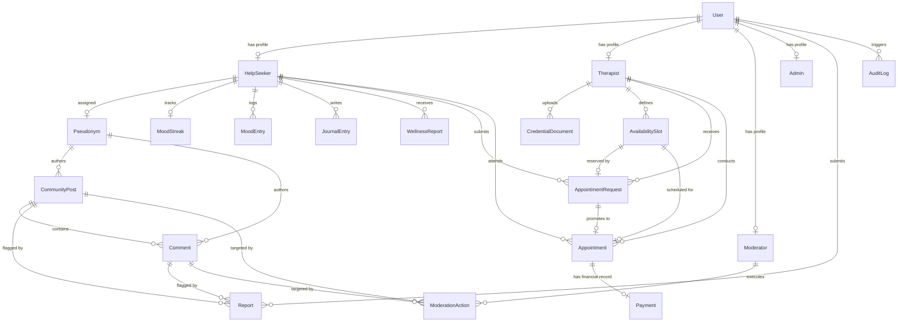

# WellNest Database Design & Prisma Schema Specification

## 1. Database Architecture & Design Principles
The WellNest relational database schema is built on **PostgreSQL** to enforce ACID compliance, strict foreign key constraints, composite unique indexes for date/slot management, and row-level locking for double-booking prevention.

### Key Data Engineering Rules:
1. **PII and Anonymity Isolation**: Community interactions (`CommunityPost`, `Comment`) reference `Pseudonym` rather than `User` or `HelpSeeker`.
2. **Date & Timezone Handling**: `MoodEntry` stores `local_date` as a calendar Date paired with user timezone to guarantee strictly one mood entry per local calendar day.
3. **Double-Booking & Slot Constraints**: `AvailabilitySlot` has a composite unique constraint `[therapist_id, start_time]` and transactional row locks (`SELECT ... FOR UPDATE`).
4. **No Raw Card Storage**: `Payment` stores only provider transaction references (`provider_transaction_id`) and status; zero card details exist in DB.

---

## 2. Entity Relationship Diagram (Mermaid)



---

## 3. Production-Ready Prisma Schema (`schema.prisma`)

```prisma
datasource db {
  provider = "postgresql"
  url      = env("DATABASE_URL")
}

generator client {
  provider = "prisma-client-js"
}

enum Role {
  HELP_SEEKER
  THERAPIST
  MODERATOR
  ADMIN
}

enum VerificationStatus {
  UNVERIFIED
  PENDING_REVIEW
  VERIFIED
  REJECTED
}

enum AppointmentStatus {
  PENDING_CONFIRMATION
  CONFIRMED
  COMPLETED
  CANCELED
  NO_SHOW
}

enum RequestStatus {
  PENDING
  APPROVED
  DECLINED
  EXPIRED
}

enum PaymentStatus {
  PENDING
  AUTHORIZED
  CAPTURED
  REFUNDED
  FAILED
}

enum ForumChannel {
  STRESS
  ACADEMIC_PRESSURE
  WORKPLACE_BURNOUT
  GENERAL_SUPPORT
}

enum ContentStatus {
  VISIBLE
  HIDDEN
  REMOVED
}

enum ReportReason {
  INAPPROPRIATE
  HARASSMENT
  SPAM
  HATE_SPEECH
  OTHER
}

enum ModerationActionType {
  RESTORE
  PERMANENT_REMOVE
  TEMPORARY_SUSPENSION
  ESCALATE
}

enum TokenType {
  EMAIL_VERIFICATION
  PASSWORD_RESET
}

// ------------------------------------------------------
// User & Auth Core Entities
// ------------------------------------------------------

model User {
  id                String       @id @default(uuid())
  email             String       @unique
  passwordHash      String
  role              Role         @default(HELP_SEEKER)
  isEmailVerified   Boolean      @default(false)
  mfaEnabled        Boolean      @default(false)
  mfaSecret         String?
  failedLoginCount  Int          @default(0)
  lockedUntil       DateTime?
  createdAt         DateTime     @default(now())
  updatedAt         DateTime     @updatedAt
  deletedAt         DateTime?

  helpSeeker        HelpSeeker?
  therapist         Therapist?
  moderator         Moderator?
  admin             Admin?
  reportsSubmitted  Report[]     @relation("ReporterRelation")
  auditLogs         AuditLog[]
  sessions          Session[]
  tokens            VerificationToken[]

  @@map("users")
}

model HelpSeeker {
  id                   String               @id @default(uuid())
  userId               String               @unique
  user                 User                 @relation(fields: [userId], references: [id], onDelete: Cascade)
  fullName             String
  timezone             String               @default("UTC")
  notificationPref     String               @default("EMAIL")
  createdAt            DateTime             @default(now())
  updatedAt            DateTime             @updatedAt

  pseudonym            Pseudonym?
  moodStreak           MoodStreak?
  moodEntries          MoodEntry[]
  journalEntries       JournalEntry[]
  wellnessReports      WellnessReport[]
  appointmentRequests  AppointmentRequest[]
  appointments         Appointment[]

  @@map("help_seekers")
}

model Therapist {
  id                   String               @id @default(uuid())
  userId               String               @unique
  user                 User                 @relation(fields: [userId], references: [id], onDelete: Cascade)
  fullName             String
  biography            String               @db.Text
  qualifications       String
  licenseNumber        String               @unique
  verificationStatus   VerificationStatus   @default(UNVERIFIED)
  yearsOfExperience    Int                  @default(0)
  consultationFee      Decimal              @db.Decimal(10, 2)
  averageRating        Float                @default(0.0)
  isVisible            Boolean              @default(false)
  createdAt            DateTime             @default(now())
  updatedAt            DateTime             @updatedAt

  credentials          CredentialDocument[]
  availabilitySlots    AvailabilitySlot[]
  appointmentRequests  AppointmentRequest[]
  appointments         Appointment[]

  @@map("therapists")
}

model Moderator {
  id                String             @id @default(uuid())
  userId            String             @unique
  user              User               @relation(fields: [userId], references: [id], onDelete: Cascade)
  department        String
  createdAt         DateTime           @default(now())

  moderationActions ModerationAction[]

  @@map("moderators")
}

model Admin {
  id              String   @id @default(uuid())
  userId          String   @unique
  user            User     @relation(fields: [userId], references: [id], onDelete: Cascade)
  permissionLevel String   @default("FULL")
  createdAt       DateTime @default(now())

  @@map("admins")
}

// ------------------------------------------------------
// Daily Mood & Dashboard Entities
// ------------------------------------------------------

model MoodEntry {
  id           String     @id @default(uuid())
  helpSeekerId String
  helpSeeker   HelpSeeker @relation(fields: [helpSeekerId], references: [id], onDelete: Cascade)
  localDate    DateTime   @db.Date
  moodEmoji    String
  note         String?    @db.VarChar(500)
  createdAt    DateTime   @default(now())
  updatedAt    DateTime   @updatedAt

  @@unique([helpSeekerId, localDate])
  @@index([helpSeekerId, localDate])
  @@map("mood_entries")
}

model MoodStreak {
  id              String     @id @default(uuid())
  helpSeekerId    String     @unique
  helpSeeker      HelpSeeker @relation(fields: [helpSeekerId], references: [id], onDelete: Cascade)
  currentStreak   Int        @default(0)
  longestStreak   Int        @default(0)
  lastLoggedDate  DateTime?  @db.Date
  updatedAt       DateTime   @updatedAt

  @@map("mood_streaks")
}

model JournalEntry {
  id           String     @id @default(uuid())
  helpSeekerId String
  helpSeeker   HelpSeeker @relation(fields: [helpSeekerId], references: [id], onDelete: Cascade)
  localDate    DateTime   @db.Date
  title        String?
  content      String     @db.Text
  createdAt    DateTime   @default(now())
  updatedAt    DateTime   @updatedAt

  @@index([helpSeekerId, localDate])
  @@map("journal_entries")
}

model WellnessReport {
  id           String     @id @default(uuid())
  helpSeekerId String
  helpSeeker   HelpSeeker @relation(fields: [helpSeekerId], references: [id], onDelete: Cascade)
  periodStart  DateTime   @db.Date
  periodEnd    DateTime   @db.Date
  summaryJson  Json
  pdfUrl       String?
  createdAt    DateTime   @default(now())

  @@index([helpSeekerId, periodStart])
  @@map("wellness_reports")
}

// ------------------------------------------------------
// Therapist Appointments & Payment Entities
// ------------------------------------------------------

model AvailabilitySlot {
  id           String               @id @default(uuid())
  therapistId  String
  therapist    Therapist            @relation(fields: [therapistId], references: [id], onDelete: Cascade)
  startTime    DateTime
  endTime      DateTime
  isBooked     Boolean              @default(false)
  createdAt    DateTime             @default(now())

  requests     AppointmentRequest[]
  appointment  Appointment?

  @@unique([therapistId, startTime])
  @@index([therapistId, startTime])
  @@map("availability_slots")
}

model AppointmentRequest {
  id           String           @id @default(uuid())
  helpSeekerId String
  helpSeeker   HelpSeeker       @relation(fields: [helpSeekerId], references: [id], onDelete: Cascade)
  therapistId  String
  therapist    Therapist        @relation(fields: [therapistId], references: [id], onDelete: Cascade)
  slotId       String
  slot         AvailabilitySlot @relation(fields: [slotId], references: [id], onDelete: Cascade)
  status       RequestStatus    @default(PENDING)
  notes        String?          @db.Text
  expiresAt    DateTime
  createdAt    DateTime         @default(now())
  updatedAt    DateTime         @updatedAt

  appointment  Appointment?

  @@map("appointment_requests")
}

model Appointment {
  id              String             @id @default(uuid())
  requestId       String             @unique
  request         AppointmentRequest @relation(fields: [requestId], references: [id], onDelete: Cascade)
  helpSeekerId    String
  helpSeeker      HelpSeeker         @relation(fields: [helpSeekerId], references: [id], onDelete: Cascade)
  therapistId     String
  therapist       Therapist          @relation(fields: [therapistId], references: [id], onDelete: Cascade)
  slotId          String             @unique
  slot            AvailabilitySlot   @relation(fields: [slotId], references: [id], onDelete: Cascade)
  status          AppointmentStatus  @default(PENDING_CONFIRMATION)
  startTime       DateTime
  endTime         DateTime
  rescheduleCount Int                @default(0)
  createdAt       DateTime           @default(now())
  updatedAt       DateTime           @updatedAt

  payment         Payment?

  @@index([helpSeekerId, status])
  @@index([therapistId, status])
  @@map("appointments")
}

model Payment {
  id                    String        @id @default(uuid())
  appointmentId         String        @unique
  appointment           Appointment   @relation(fields: [appointmentId], references: [id], onDelete: Cascade)
  amount                Decimal       @db.Decimal(10, 2)
  currency              String        @default("USD")
  status                PaymentStatus @default(PENDING)
  providerTransactionId String?
  createdAt             DateTime      @default(now())
  updatedAt             DateTime      @updatedAt

  @@map("payments")
}

model CredentialDocument {
  id           String             @id @default(uuid())
  therapistId  String
  therapist    Therapist          @relation(fields: [therapistId], references: [id], onDelete: Cascade)
  documentType String
  documentUrl  String
  status       VerificationStatus @default(PENDING_REVIEW)
  uploadedAt   DateTime           @default(now())

  @@map("credential_documents")
}

// ------------------------------------------------------
// Anonymous Community Forum Entities
// ------------------------------------------------------

model Pseudonym {
  id            String          @id @default(uuid())
  helpSeekerId  String          @unique
  helpSeeker    HelpSeeker      @relation(fields: [helpSeekerId], references: [id], onDelete: Cascade)
  pseudonymName String          @unique
  createdAt     DateTime        @default(now())

  posts         CommunityPost[]
  comments      Comment[]

  @@map("pseudonyms")
}

model CommunityPost {
  id          String             @id @default(uuid())
  pseudonymId String
  pseudonym   Pseudonym          @relation(fields: [pseudonymId], references: [id], onDelete: Cascade)
  channel     ForumChannel
  title       String             @db.VarChar(200)
  content     String             @db.VarChar(2000)
  status      ContentStatus      @default(VISIBLE)
  reportCount Int                @default(0)
  createdAt   DateTime           @default(now())
  updatedAt   DateTime           @updatedAt

  comments    Comment[]
  reports     Report[]
  actions     ModerationAction[]

  @@index([channel, status, createdAt])
  @@map("community_posts")
}

model Comment {
  id              String             @id @default(uuid())
  postId          String
  post            CommunityPost      @relation(fields: [postId], references: [id], onDelete: Cascade)
  pseudonymId     String
  pseudonym       Pseudonym          @relation(fields: [pseudonymId], references: [id], onDelete: Cascade)
  parentCommentId String?
  parentComment   Comment?           @relation("CommentReplies", fields: [parentCommentId], references: [id], onDelete: SetNull)
  replies         Comment[]          @relation("CommentReplies")
  content         String             @db.VarChar(1000)
  status          ContentStatus      @default(VISIBLE)
  reportCount     Int                @default(0)
  createdAt       DateTime           @default(now())
  updatedAt       DateTime           @updatedAt

  reports         Report[]
  actions         ModerationAction[]

  @@index([postId, status])
  @@map("comments")
}

model Report {
  id             String       @id @default(uuid())
  reporterUserId String
  reporterUser   User         @relation("ReporterRelation", fields: [reporterUserId], references: [id], onDelete: Cascade)
  postId         String?
  post           CommunityPost? @relation(fields: [postId], references: [id], onDelete: Cascade)
  commentId      String?
  comment        Comment?     @relation(fields: [commentId], references: [id], onDelete: Cascade)
  reason         ReportReason
  details        String?      @db.Text
  createdAt      DateTime     @default(now())

  @@map("reports")
}

model ModerationAction {
  id           String               @id @default(uuid())
  moderatorId  String
  moderator    Moderator            @relation(fields: [moderatorId], references: [id], onDelete: Cascade)
  postId       String?
  post         CommunityPost?       @relation(fields: [postId], references: [id], onDelete: Cascade)
  commentId    String?
  comment      Comment?             @relation(fields: [commentId], references: [id], onDelete: Cascade)
  actionType   ModerationActionType
  durationDays Int?
  reasoning    String               @db.Text
  createdAt    DateTime             @default(now())

  @@map("moderation_actions")
}

// ------------------------------------------------------
// Security & System Audit Entities
// ------------------------------------------------------

model AuditLog {
  id             String   @id @default(uuid())
  userId         String?
  user           User?    @relation(fields: [userId], references: [id], onDelete: SetNull)
  action         String
  resource       String
  ipAddress      String
  userAgent      String
  payloadSummary Json?
  createdAt      DateTime @default(now())

  @@index([userId, createdAt])
  @@index([action, createdAt])
  @@map("audit_logs")
}

model Session {
  id         String   @id @default(uuid())
  userId     String
  user       User     @relation(fields: [userId], references: [id], onDelete: Cascade)
  tokenHash  String   @unique
  expiresAt  DateTime
  isRevoked  Boolean  @default(false)
  createdAt  DateTime @default(now())

  @@map("sessions")
}

model VerificationToken {
  id        String    @id @default(uuid())
  userId    String
  user      User      @relation(fields: [userId], references: [id], onDelete: Cascade)
  token     String    @unique
  tokenType TokenType
  expiresAt DateTime
  createdAt DateTime  @default(now())

  @@map("verification_tokens")
}
```
